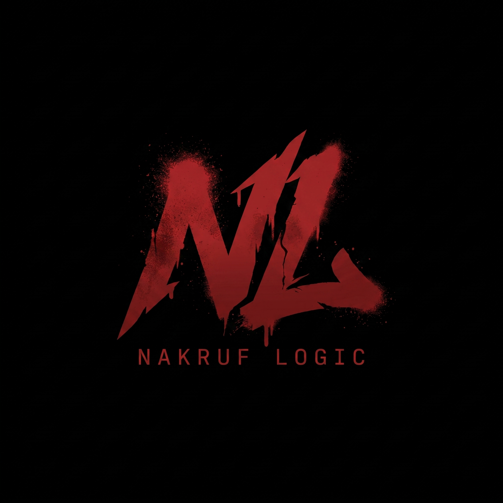
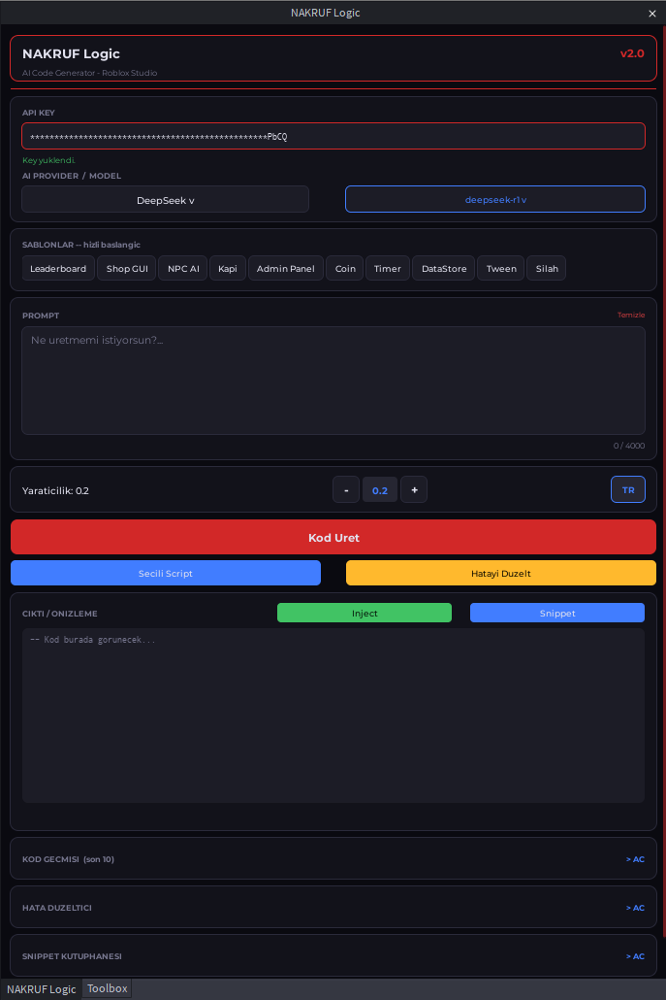
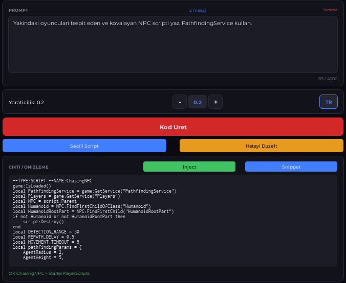
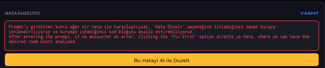
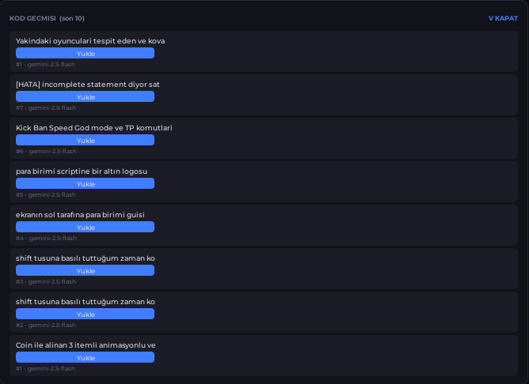
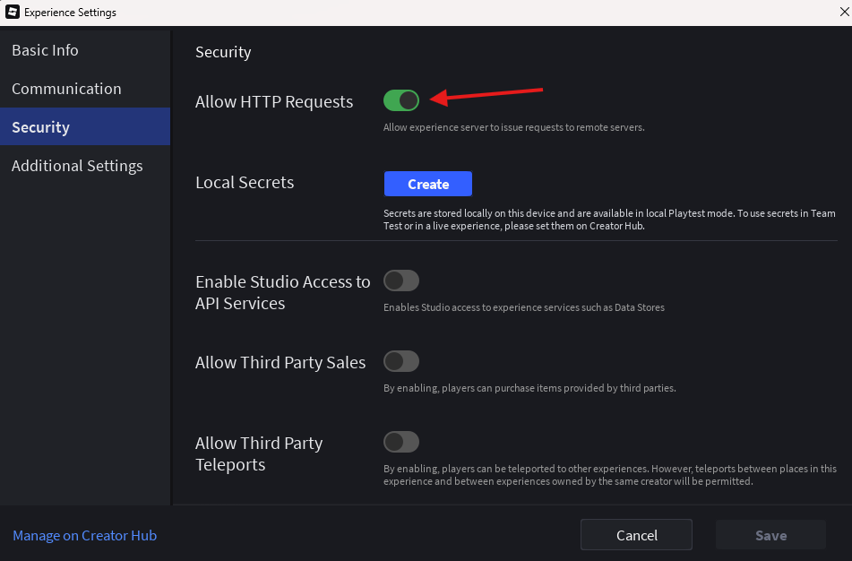

  
    
  <h1>NAKRUF Logic v2.0</h1>
  
<b>An AI-Powered Code Generator Plugin for Roblox Studio</b>

  

    
    
    
  

---

Bu proje, Roblox Studio için geliştirilmiş, içerisinde birçok farklı yapay zeka modelini (OpenAI, Gemini, Claude, DeepSeek) barındıran gelişmiş bir **kod üretim (Code Generation)** eklentisidir.  
Kurulumu çok basittir; bütün sistem tek bir dosya (`Main.server.lua`) içerisinde (self-contained) çalışır. Ekstra modüllerle uğraşmanıza gerek yoktur!

  

---

## ✨ Özellikler ve Modüller

Projemiz, kod yazma sürecinizi hızlandırmak ve kolaylaştırmak için birçok alt modüle ayrılmıştır:

### 🤖 1. Sağlayıcılar ve Modeller (Providers)
İstediğiniz yapay zekayı anında seçip kullanabilirsiniz:
- **OpenAI:** gpt-4o, gpt-4o-mini, gpt-4-turbo, o1-mini
- **Gemini:** gemini-2.5-flash, gemini-2.5-pro, vb.
- **Claude:** claude-opus-4-5, claude-sonnet-4-5 vb.
- **DeepSeek:** deepseek-r1, deepseek-v3

### ⚙️ 2. Kod İşlemci ve Enjeksiyon (Code Processor)
Yapay zekadan gelen ham metni Roblox Studio'da anında çalıştırılabilir hale getirir.
- Gelen cevaptaki Markdown vb. kalıntıları temizler.
- `loadstring()` kullanarak anlık sözdizimi (syntax) kontrolü yapar.
- Workspace veya StarterGui içine kodu **otomatik olarak** yerleştirir.
- Seçili bir scriptiniz varsa kod doğrudan o scriptin içine yazılır!

  

### 3. Seçim ve Bağlam Yönetimi (Selection Context)
Siz Studio'da bir objeye tıkladığınızda, yapay zeka bu objenin;
- Sınıfını (`ClassName`),
- Adını ve pozisyonunu,
- Eğer bir script ise içindeki **mevcut kodu** otomatik okur ve buna göre kod üretir.

### 🛠️ 4. Akıllı Hata Düzeltici (Error Fixer)
Output penceresinden aldığınız o can sıkıcı kırmızı hata mesajlarını kopyalayıp buraya yapıştırın. Yapay zeka önceki kodunuzu ve hatayı analiz edip sorunu otomatik olarak çözer!

  

### 📜 5. Geçmiş ve Snippet Kütüphanesi (History & Snippets)
Aynı kodu tekrar tekrar yazdırmayın! 
- **Geçmiş:** Ürettiğiniz son 10 kod hafızada tutulur.
- **Snippets:** Sık kullandığınız sistemleri isimlendirerek Snippet kütüphanesine kaydedin.

  

---

## Kurulum (Installation)

Sadece saniyeler içinde kurup kullanmaya başlayabilirsiniz:

1. Bu projedeki `Main.server.lua` dosyasını indirin.
2. Dosyayı bilgisayarınızdaki yerel **Roblox Eklentileri (Plugins)** klasörüne kopyalayın:
   - Windows için: `%LocalAppData%\Roblox\Plugins\`
3. Roblox Studio'yu yeniden başlatın.
4. **Çok Önemli:** Oyun ayarlarından HTTP isteklerini açmayı unutmayın!  
   `Game Settings > Security > Allow HTTP Requests`

  

---

## Nasıl Kullanılır? 

### 🔑 1. API Key (Anahtar) Alma ve Girme
Bu eklentinin çalışabilmesi için seçtiğiniz yapay zeka sağlayıcısına ait kişisel bir **API Key**'e ihtiyacınız vardır:
- **OpenAI:** [platform.openai.com](https://platform.openai.com/api-keys) adresinden key alabilirsiniz.
- **Gemini:** Google AI Studio üzerinden ücretsiz API key alabilirsiniz.
- **Claude / DeepSeek:** İlgili platformların geliştirici (developer) sayfalarından API Key alabilirsiniz.
*Aldığınız Key'i eklentideki "API KEY" kutusuna yapıştırın. Enter'a bastığınızda "Key yüklendi" uyarısını göreceksiniz (Key'iniz Roblox sunucularına gönderilmez, sadece bilgisayarınıza yerel ve güvenli olarak kaydedilir).*

### 2. Temel Kod Üretimi
1. "API Provider / Model" kısmından kullanmak istediğiniz yapay zekayı (örn: DeepSeek v3) seçin.
2. **"PROMPT"** kutusuna ne yapmak istediğinizi yazın. (Örn: *"Oyuncuya değdiğinde canını azaltan kırmızı bir kill brick yap."*)
3. Kırmızı renkli **"Kod Üret"** butonuna basın. Yapay zeka kodu yazıp projenize (Workspace'e veya StarterGui'ye) otomatik olarak dahil edecektir.

### 3. "Seçili Script" Butonu ve Bağlam (Context) Kullanımı
Eklentimiz Roblox Studio'da **o an neyi seçtiğinizi (Selection)** çok iyi anlar!
- **Bağlam (Context) Okuma:** Eğer Explorer penceresinde hali hazırda var olan bir `Script` veya `LocalScript` objesine tıklayıp (seçili tutup) prompt yazarsanız, yapay zeka **o scriptin içindeki mevcut kodu okur** ve ona göre cevap verir. (Aynı şekilde bir Part seçerseniz de onu algılar).
- **"Seçili Script" Butonu İle Kod Güncelleme:** Yapay zekaya bir kod ürettirdikten sonra (veya hatayı düzelttirdikten sonra), bu yeni kodun sıfırdan yeni bir script olarak eklenmesini **istemiyorsanız**, Explorer'dan değiştirmek istediğiniz mevcut Script'e tıklayın ve mavi renkli **"Seçili Script"** butonuna basın. Üretilen kod, saniyeler içinde o dosyanın üzerine yazılacaktır!

### 4. Hata Düzeltici (Error Fixer) Kullanımı
Oyunu test ederken Output'ta hata mı aldınız? 
1. Hatayı kopyalayın.
2. Eklentideki sarı renkli **"Hatayı Düzelt"** sekmesini açıp hatayı yapıştırın.
3. Yapay zeka hatayı okuyacak, düzeltecek ve size doğru kodu verecektir. Ardından **"Seçili Script"** butonuna basarak anında bozuk kodunuzu yenisiyle değiştirebilirsiniz!
